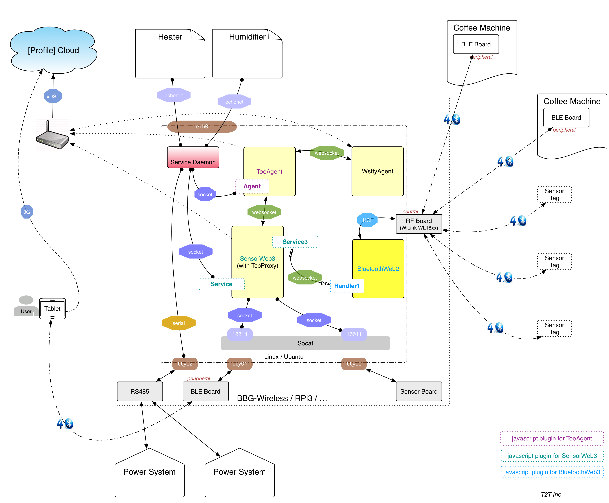

<!-- START doctoc generated TOC please keep comment here to allow auto update -->
<!-- DON'T EDIT THIS SECTION, INSTEAD RE-RUN doctoc TO UPDATE -->
**Table of Contents**  *generated with [DocToc](https://github.com/thlorenz/doctoc)*

- [demo1](#demo1)
  - [Build](#build)
  - [Setup and Installation](#setup-and-installation)
  - [Run](#run)

<!-- END doctoc generated TOC please keep comment here to allow auto update -->

# demo1

This agent demonstrates how to implement [Agent](../../docs/agent.ls) with simple logic (showing the CPU percentages on Emoji display of a box with TOE 3.0+ software), so the app can be loaded by ToeAgent as a plugin to execute:



The agent is written in [ES6](https://www.w3schools.com/js/js_es6.asp), very short:

```javascript
// Get logger apis in ToeAgent
var { DBG, ERR, WARN, INFO } = global.getLogger(__filename);

// Get the Agent class declaration from ToeAgent
var { Agent } = global.getBundledModules();

class Demo1 extends Agent {

    constructor(dummy) {
        super(module);
        // 
        this.preferences['ps']['sensor_events'] = [
            'linux::*::cpu::*',
            'sensorboard::*::humidity::*'
        ];
    }

    /**
     * Notify the Agent instance with a sensor data update event that is registered at
     * Agent initiation phase by specify `ps/sensor_events` field in runtime preference
     * json object.
     */
    atSensorUpdated(timestamp, p_type, p_id, s_type, s_id, pp) {
        var self = this;
        var {jarvis} = self;
        INFO(`${JSON.stringify(timestamp)}: ${p_type}/${p_id}/${s_type}/${s_id} => ${JSON.stringify(pp)}`);
        if ((p_type == 'linux') && (s_type == 'cpu')) {
            var percentage = Math.floor(pp['percentage']);
            jarvis.performActuatorAction('sensorboard', 'ttyO1', 'emoji', '_', 'show_number', percentage, null, null, (err) => {
                if (err) {
                    ERR(err, `failed to set emoji to percentage ${percentage}`);
                }
            });
        }
    }
}

module.exports = exports = Demo1;
```

The agent implements following logics:

- Register to listen these sensor events
  - `linux::*::cpu::*`
  - `sensorboard::*::humidity::*`
- Request SensorWeb3 to show CPU percentages on Emoji display when receiving CPU sensor data update
- Display all received sensor update events on console


## Execution with Remote Box

### Prerequisites

First, you need to find a box installed with TOE 3.0+ software.

Second, please add your SSH public key to the **root** user on that box, or create your own user account on that box with your public key installed. This step is quite important because the launch script [run-toeagent-with-remote-box](run-toeagent-with-remote-box) heavily depends on SSH to retrieve necessary information from that box, and setup a similar environment on your PC workstation.

Third, please install following softwares on your Mac OS X or Ubuntu/Linux workstation:

- [Docker](https://docs.docker.com/install/)
- [jq](https://stedolan.github.io/jq/)
- [js-yaml](http://nodeca.github.io/js-yaml/) (e.g. `npm install -g js-yaml`)

Forth, shutdown ToeAgent process running on that box, with following command. The existing ToeAgent process might be conflicted with this agent that tries to control the box remotely.

  ```
echo shutdown | socat - unix-connect:/var/run/yapps/toe-agent.sock
  ```

### Run

Please execute the launch script `run-toeagent-with-remote-box` with the ip address of remote box as 1st argument. For example:

```text
$  ./run-toeagent-with-remote-box 10.42.0.59
SCRIPT_CURRENT_NAME = run-toeagent-with-remote-box
SCRIPT_BASE_NAME = run-toeagent
SCRIPT_SUBCOMMAND = with-remote-box
FUNC = run_with_remote_box
10.42.0.59 is alive
10.42.0.59 port 22 is ready
10.42.0.59 with user root to login SSH service
scp root@10.42.0.59:/tmp/cloud.bashrc /tmp/viXMfV
10.42.0.59:/tmp/cloud.bashrc is downloaded =>
	CLOUD_ARCHIVE_URL=https://archives.t2t.io
	CLOUD_FILE_FC=https://fc.t2t.io
	CLOUD_FILE_PSWD=****
	CLOUD_FILE_SITE=files.t2t.io
	CLOUD_FILE_USER=device
	CLOUD_RELEASE_PASS=****
	CLOUD_RELEASE_URL=https://releases.t2t.io
	CLOUD_RELEASE_USER=agent
10.42.0.59:/tmp/ttt_system is downloaded =>
```

In the beginning, the launch script checks remote box, and tries to use SSH with **root** user to login that box.

```
10.42.0.59/profile => conscious
10.42.0.59/mnt => /mnt/app/profiles/conscious
10.42.0.59/env => production
10.42.0.59/entry => 20190204d
10.42.0.59/toe-agent => 0.9.5
10.42.0.59/toe-agent/config/production.json =>

...

launch script:

#!/bin/bash
#
docker run \
	-it \
	--init \
	--rm \
	--name toe-agent-test-0215-030504 \
	-p 6020:6020  \
	-v /tmp/toe-agent.conf.json:/yapps/config/default.json \
	-v /Users/yagamy/Works/workspaces/t2t/yapps-tt/externals/third_parties/toe-example-plugins/plugins/agent-demo1:/opt/plugins/agent-demo1 \
	-e CLOUD_ARCHIVE_URL="https://archives.t2t.io" \
	-e CLOUD_FILE_FC="https://fc.t2t.io" \
	-e CLOUD_FILE_PSWD="****" \
	-e CLOUD_FILE_SITE="files.t2t.io" \
	-e CLOUD_FILE_USER="device" \
	-e CLOUD_RELEASE_PASS="****" \
	-e CLOUD_RELEASE_URL="https://releases.t2t.io" \
	-e CLOUD_RELEASE_USER="agent"  \
	-e YAPPS_DUMP_LOADED_CONFIG=false \
	-e YAPPS_EXTRA_AGENTS=/opt/plugins/agent-demo1 \
	 \
	 \
	tictactoe/yapps.toe-agent:0.9.5 \
		node \
			--expose-gc \
			index.js \
				 \
				-b 'tic-client.uploaders.dg-ts.enabled=false' \
				-b 'tic-client.uploaders.dg-ss.enabled=false' \
				-b 'tic-client.uploaders.dm-po.enabled=false' \
				-s system-info.remote=10.42.0.59 \
				-s communicator.connections.ps_s_data.url=tcp://10.42.0.59:6022 \
				-s communicator.connections.ps_p_data.url=tcp://10.42.0.59:6023 \
				-s sensorweb3-client.wss.server=http://10.42.0.59:6020 \
				-s sensorweb3-client.wss.token=ABCD

```

Later, the launch script continues retrieving necessary information from remote box via SSH/SCP. Then, based on these information, generate 2nd stage of launch script to startup the Docker image `tictactoe/yapps.toe-agent`, and load this agent to execute.


```text
02/14 19:11:24 agent-demo1::agent           [INFO] {"boots":39,"uptime":176407856,"epoch":1550171484234}: sensorboard/ttyO1/humidity/0 => {"temperature":28.56,"humidity":60.61,"humidity_raw":50.21,"temperature_raw":31.16}
02/14 19:11:26 agent-demo1::agent           [INFO] {"boots":39,"uptime":176409962,"epoch":1550171486340}: sensorboard/ttyO1/humidity/0 => {"temperature":28.56,"humidity":60.56,"humidity_raw":50.16,"temperature_raw":31.16}
02/14 19:11:29 agent-demo1::agent           [INFO] {"boots":39,"uptime":176412068,"epoch":1550171488446}: sensorboard/ttyO1/humidity/0 => {"temperature":28.56,"humidity":60.56,"humidity_raw":50.16,"temperature_raw":31.16}
02/14 19:11:31 agent-demo1::agent           [INFO] {"boots":39,"uptime":176414174,"epoch":1550171490552}: sensorboard/ttyO1/humidity/0 => {"temperature":28.56,"humidity":60.56,"humidity_raw":50.16,"temperature_raw":31.16}
02/14 19:11:32 agent-demo1::agent           [INFO] {"boots":39,"uptime":176415083,"epoch":1550171491460}: linux/7F000001/cpu/_ => {"percentage":7.5}
02/14 19:11:33 agent-demo1::agent           [INFO] {"boots":39,"uptime":176416281,"epoch":1550171492659}: sensorboard/ttyO1/humidity/0 => {"temperature":28.56,"humidity":60.56,"humidity_raw":50.16,"temperature_raw":31.16}
02/14 19:11:35 agent-demo1::agent           [INFO] {"boots":39,"uptime":176418387,"epoch":1550171494765}: sensorboard/ttyO1/humidity/0 => {"temperature":28.56,"humidity":60.56,"humidity_raw":50.16,"temperature_raw":31.16}
02/14 19:11:37 agent-demo1::agent           [INFO] {"boots":39,"uptime":176420493,"epoch":1550171496871}: sensorboard/ttyO1/humidity/0 => {"temperature":28.65,"humidity":60.56,"humidity_raw":50.16,"temperature_raw":31.25}
02/14 19:11:39 agent-demo1::agent           [INFO] {"boots":39,"uptime":176422599,"epoch":1550171498977}: sensorboard/ttyO1/humidity/0 => {"temperature":28.65,"humidity":60.56,"humidity_raw":50.16,"temperature_raw":31.25}
02/14 19:11:41 agent-demo1::agent           [INFO] {"boots":39,"uptime":176424705,"epoch":1550171501083}: sensorboard/ttyO1/humidity/0 => {"temperature":28.65,"humidity":60.56,"humidity_raw":50.16,"temperature_raw":31.25}
02/14 19:11:42 agent-demo1::agent           [INFO] {"boots":39,"uptime":176425095,"epoch":1550171501472}: linux/7F000001/cpu/_ => {"percentage":7.9}
```


For those lines with `agent-demo1::agent`, they show the `demo1` agent receives sensor updates from SensorWeb3 running on `10.42.0.59`.